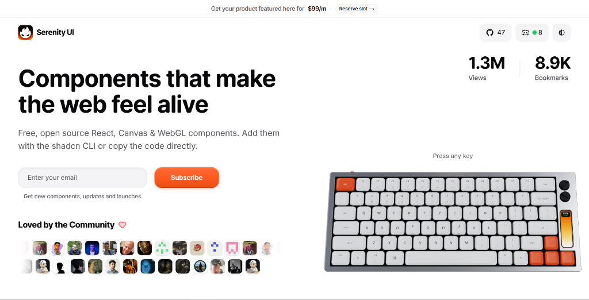

<div align="center">
  
  <h1>Serenity UI</h1>
  <p>Free, open source React, Canvas & WebGL components that make the web feel alive.</p>

  <p>
    <a href="https://serenity-ui.com"><strong>Explore Components</strong></a> •
    <a href="https://discord.com/invite/kzk6uWey3g"><strong>Discord Community</strong></a> •
    <a href="https://x.com/ayushmxxn"><strong>Twitter / X</strong></a>
  </p>

  <br />

  <a href="https://serenity-ui.com">
    
  </a>
</div>

<br />

## Features

- **Copy & Paste**: Add components via the shadcn CLI or copy source code directly.
- **WebGL & Canvas**: Shaders, lasers, and interactive 3D physics built with React and Tailwind CSS.
- **Framework Support**: Works with Next.js (App & Pages Router), Vite, Remix, Astro, and React 18/19.
- **Customizable**: Built with standard Tailwind CSS classes and CSS custom properties.
- **Accessible**: Semantic markup, ARIA compliance, and keyboard navigation.

---

## Quick Start

### 1. Using shadcn CLI

Install any component directly into your project using the shadcn registry:

```bash
# npm
npx shadcn@latest add https://serenity-ui.com/r/vintage-keyboard.json

# pnpm
pnpm dlx shadcn@latest add https://serenity-ui.com/r/vintage-keyboard.json

# bun
bunx --bun shadcn@latest add https://serenity-ui.com/r/vintage-keyboard.json
```

### 2. Manual Installation

1. Browse components on [serenity-ui.com](https://serenity-ui.com).
2. Click **Code** on any component to view its source.
3. Copy the file into your `components/` directory and install the listed dependencies.

---

## Component Collection

### Components

| Component | Description | CLI Command |
| :--- | :--- | :--- |
| **Vintage Keyboard** | Mechanical keyboard with real-time sound synthesis & 3D keycaps | `npx shadcn@latest add https://serenity-ui.com/r/vintage-keyboard.json` |
| **Portfolio Book** | Interactive sketchbook portfolio with 3D page flip physics | `npx shadcn@latest add https://serenity-ui.com/r/portfolio-book.json` |
| **Flame Button** | Fiery flame glow button with mouse tracking & fiery gradients | `npx shadcn@latest add https://serenity-ui.com/r/flame-button.json` |
| **Carousel 360** | 3D cylinder image carousel with drag and click rotation | `npx shadcn@latest add https://serenity-ui.com/r/carousel-360.json` |
| **Tubelight Navbar** | Floating island navbar with glowing lamp indicator | `npx shadcn@latest add https://serenity-ui.com/r/tubelight-navbar.json` |
| **Typewriter Testimonial** | Showcase card with typewriter effect & pen animation | `npx shadcn@latest add https://serenity-ui.com/r/typewriter-testimonial.json` |
| **Brand Marquee** | Continuous logo marquee with edge fading and pause-on-hover | `npx shadcn@latest add https://serenity-ui.com/r/brand-marquee.json` |
| **3D Flip Card** | Layered card stack with spring-driven 3D fanning | `npx shadcn@latest add https://serenity-ui.com/r/3d-flip-card.json` |
| **Swipe Card** | Gestural swipeable card stack with drag throw physics | `npx shadcn@latest add https://serenity-ui.com/r/swipe-card.json` |
| **Image Carousel** | Stacked parallax image carousel with peeling transitions | `npx shadcn@latest add https://serenity-ui.com/r/image-carousel.json` |
| **Image Gallery** | Expanding image gallery with horizontal spring transitions | `npx shadcn@latest add https://serenity-ui.com/r/image-gallery.json` |

### Blocks

| Block | Description | CLI Command |
| :--- | :--- | :--- |
| **Testimonial** | Multi-row marquee with voice waveform audio & video dialog | `npx shadcn@latest add https://serenity-ui.com/r/testimonial.json` |

---

## Local Development

To run the Serenity UI documentation site locally:

```bash
# Clone the repository
git clone https://github.com/ayushmxxn/serenity-ui.git
cd serenity-ui

# Install dependencies
npm install

# Start development server
npm run dev
```

Open [http://localhost:3000](http://localhost:3000) to view the site.

---

## Contributing

Contributions are welcome! If you'd like to fix a bug or add a new component:

1. Fork the repository.
2. Create a feature branch (`git checkout -b feature/new-component`).
3. Commit your changes (`git commit -m 'feat: add new component'`).
4. Push to the branch (`git push origin feature/new-component`).
5. Open a Pull Request.

---

## License

Serenity UI is free and open source under the [MIT License](LICENSE).
